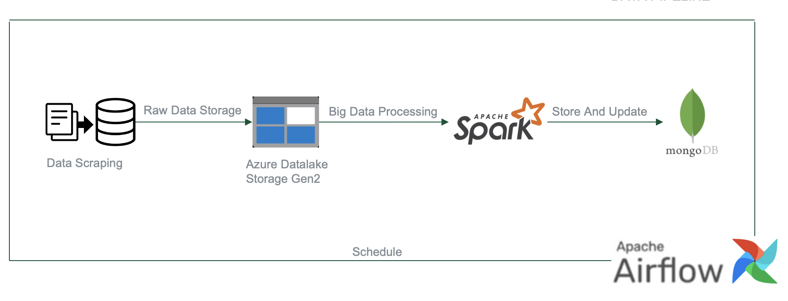

# Trip Finder Data
**Overview**

TripFinder offers personalized travel experiences tailored to users' preferences, budget, and time constraints. We provide recommendations for destinations, transportation, accommodation, and dining spots to ensure an immersive exploration of local cultures and destinations.

**TechStack**

- Apache Spark
- MongoDB
- Apache Airflow
- Azure Data Lake Storage Gen 2

**Data Pipeline**

- Collect data from many data sources with many different platforms.
- Get data daily to update changes in attribute values
- Store raw data in the cloud using Microsoft Azure
- Use spark to process large data to achieve good performance
- Use mongodb to store processed data

**AI Service**

- Deploy chatbot into the application using Gemini's existing API to integrate into the application
- Leverage Gemini to automatically prioritize popular locations to generate personalized schedules for service suggestions
- Integrate AI Image section to help users search for places using images
